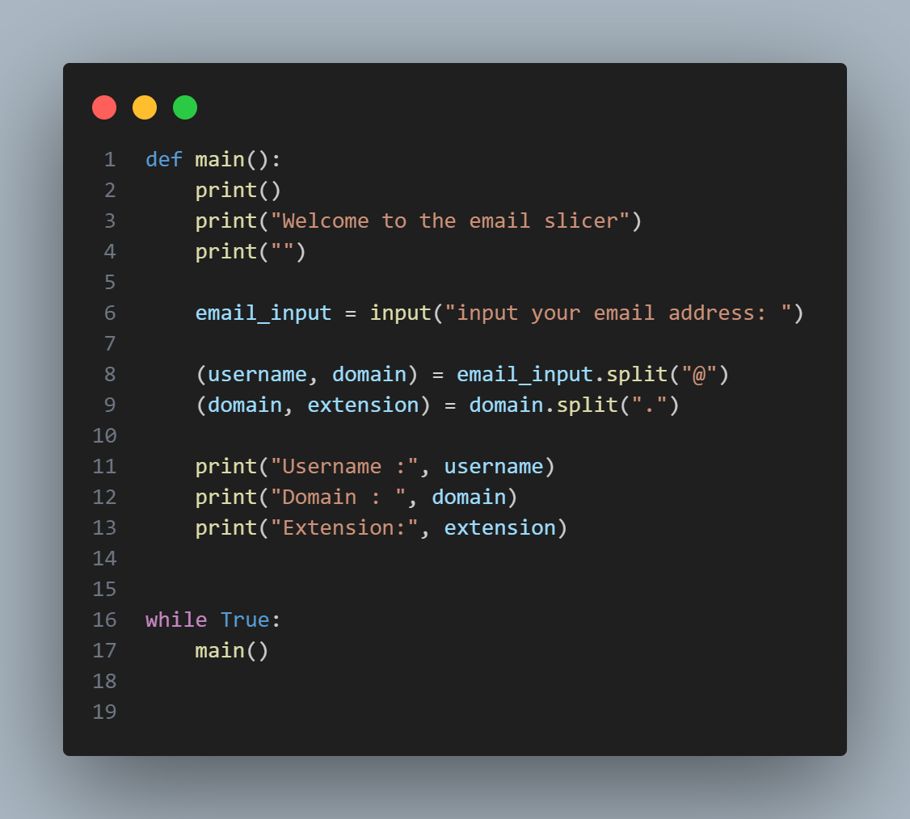

# Email-slicer

I watched a few videos and made a few steps in making an email-slicer:

1. First, i used a define function with a function(main()), then i printed a welcoming message like;'welcome to the email-slicer', then i stored an input in a variable(email_input) then printed something like; input your email address 
2. second, i made two variables in a bracket(username, domain) equal to the variable i first made then added the .split() method, then put in a string '@'. I also stored two variables in a bracket(domain, extension), then i put the variable(domain).split('.')  
3. Third, i printed a string('username: ') then i added a comma(,) and added the variable(username),the i did the same thing for the domain with the string("Domain") and extension with the string("Extension")
4. Last, i made a while loop(While True:) then added a main() function there

The output will print out 'Welcome to the email-slicer', then ask the user to input their email address, then if the user print something like; 'User@gmail.com' the output will bring out the following; 
Username : User                           
Domain : gmail
Extension : com

Then it will print everything all over again(because of the while loop). Also add some spacing(print()), so when you run the code it will look neater,also in your code.

